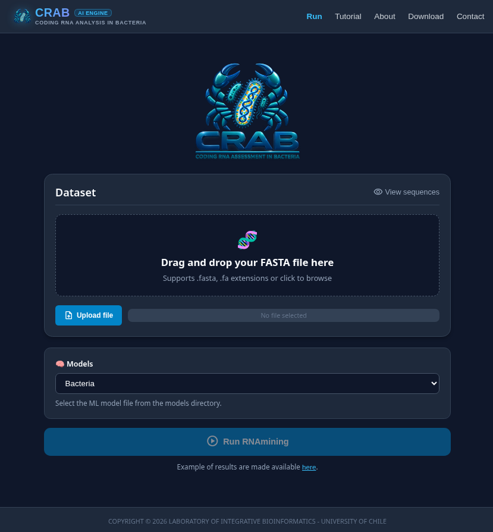
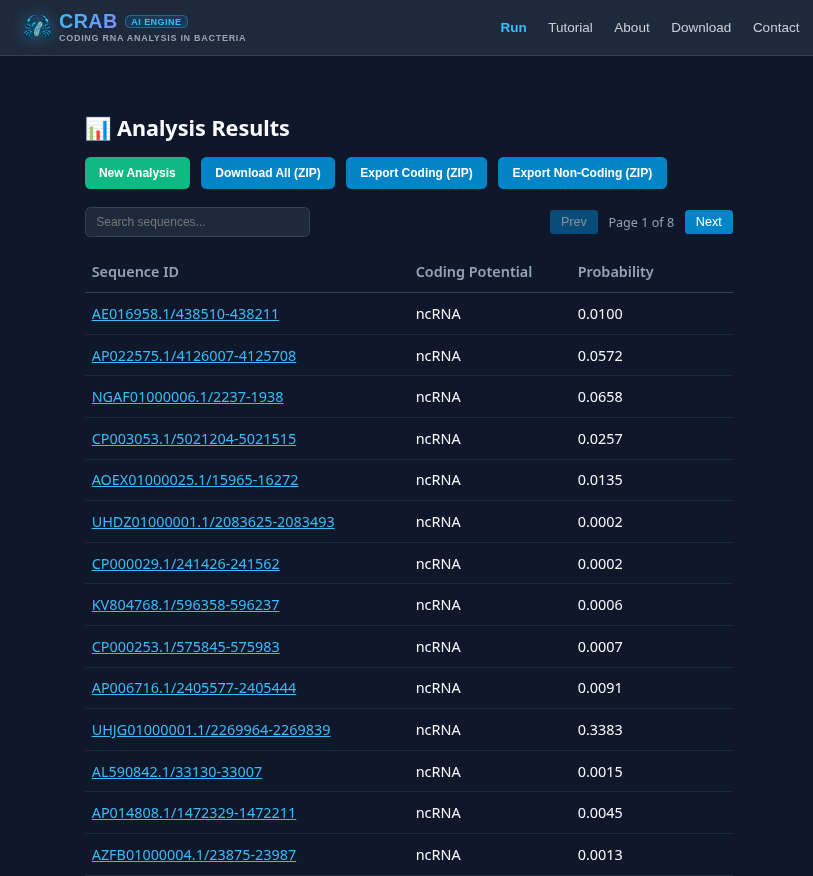

# CRAB: Coding RNA Analysis Benchmark


**CRAB** is an institutional bioinformatic platform designed for high-throughput coding potential classification of transcriptomic sequences (`coding_protein` vs. `ncRNA`) using native XGBoost architectures, 64-dimensional codon relative frequency matrices, and calibrated decision thresholds.

## 📸 Platform Showcase

### (A) Dataset Submission & Model Selection

*Figure 1: Drag-and-drop FASTA upload interface with dynamic ML model selection and instant validation.*

### (B) Interactive Results & Partitioned Export

*Figure 2: Real-time classification table displaying coding potential, probabilities, search filters, and one-click ZIP download.*

## 🏗️ Technical Architecture

- **Backend:** FastAPI 0.110+, Python 3.11+, Uvicorn (Asynchronous ASGI).
- **ML Engine:** Native XGBoost (v2.0+) with calibrated 0.4629 threshold.
- **Feature Engineering:** 64-dimensional non-overlapping codon matrix.
- **Parsing:** Biopython stream-based FASTA processing (`Bio.SeqIO`).
- **Frontend:** React 19 + Vite SPA (Headless hooks, JSZip, zero-I/O).

## 📂 Project Structure

```text
.
├── backend/                 # Python FastAPI Microservice
│   ├── app/
│   │   ├── models/          # Serialized Models (.pkl / .joblib)
│   │   ├── schemas/         # Primitive-bound Pydantic DTOs
│   │   └── utils/           # Codon Feature Extraction & Stream Parsers
│   └── tests/               # Military-Grade Pytest Suite (Hexagonal Mocks)
├── frontend/                # React 19 + Vite Single Page Application
│   └── src/
│       ├── components/      # Pure UI Views (Cards, Tables, Navbar)
│       ├── hooks/           # Headless State Hooks (Upload, Table, Export)
│       └── pages/           # Decoupled Routing Views (Home, Results)
├── nginx/                   # Reverse Proxy Configuration (Port 80)
└── leai_docs/               # Agentic Planning & Roadmap Trackers
```

## 🚀 Quick Start

### Docker Compose (Recommended Production Run)

```bash
docker-compose up --build -d
```

### Local Development Setup

#### Backend Setup

```bash
cd backend
python -m venv venv
source venv/bin/activate  # On Windows: venv\Scripts\activate
pip install -r requirements.txt
uvicorn app.main:app --reload --port 8000
```


#### Frontend Setup

```bash
cd frontend
npm install
npm run dev


## 🛡️ API Endpoints

* `GET  /api/v1/models`: Scans and lists available ML models from directory.
* `POST /api/inference`: Multipart file upload with direct batch XGBoost inference.
* `POST /api/v1/fasta/upload`: FASTA syntax check and stream DTO parsing.
* `POST /api/v1/fasta/predict`: DTO-based batch inference pipeline.
* `GET  /api/v1/fasta/sample`: Benchmark sample FASTA sequences.
```
